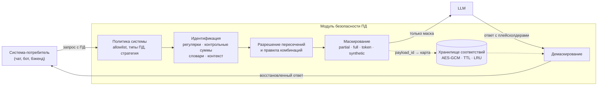

# Архитектура

## Схема



Исходные персональные данные пересекают границу модуля только в двух местах:
на входе от потребителя и на выходе обратно к нему. Во внешнюю модель уходит
исключительно замаскированный текст.

## Принятые решения

### На горячем пути нет LLM

Вариант «отдать распознавание ПД языковой модели» отвергнут сознательно. Целевая
latency — доли секунды при тысяче запросов в секунду, а любой вызов модели это
десятки-сотни миллисекунд плюс чужая доступность, лимиты и стоимость. Детекция
строится на регулярных выражениях, контрольных суммах, словарях и контекстных
правилах — детерминированно и воспроизводимо.

Плата за это — правила приходится писать руками, и текст с нетипичной структурой
может быть распознан хуже, чем это сделала бы модель. Компенсируется
расширяемостью: новый тип ПД добавляется записью в YAML.

### Решение принимается не по форме, а по проверке

Шаблон только находит кандидата. Дальше:

* **контрольная сумма** — карта (Луна + диапазон BIN), ИНН, СНИЛС;
* **контекст** — CVV, ПИН, паспорт без разделяющих слов, короткий телефон;
* **словарь и морфология** — ФИО;
* **порог компонентов** — адрес.

Без этого шага детектор из полезного превращается в генератор ложных
срабатываний: примерно каждый десятый случайный набор из 16 цифр проходит
алгоритм Луна.

### Пересечения разрешаются явно

Детекторы работают независимо и находят пересекающиеся куски: «4509 123456» это
и паспорт, и потенциальный телефон. Побеждает уверенность, затем длина спана.
Принятые интервалы хранятся отсортированными, проверка — бинарным поиском по
двум соседям. Наивный перебор на тексте в 100 000 токенов давал пять секунд
только на этом шаге; сейчас весь такой текст обрабатывается за 824 мс.

### Крупные тексты режутся на части

Текст длиннее 40 000 символов разбивается на куски по 20 000 с нахлёстом в 200
символов — чтобы сущность на стыке не потерялась. Позиции пересчитываются в
координаты исходной строки.

### Обработчики асинхронные

FastAPI выполняет синхронные обработчики в пуле потоков. Для работы длиной
0.2 мс накладные расходы на передачу в поток и борьба за GIL дороже самой
работы: в замерах это давало 234 RPS против 2262 RPS у асинхронного варианта.
Поэтому обработчики `async`, а сетевой бэкенд хранилища тоже асинхронный —
блокирующий клиент Redis остановил бы event loop.

### Хранилище соответствий — сознательный компромисс

Чтобы демаскировать, нужно помнить оригинал. Это означает, что персональные
данные живут в сервисе дольше одного запроса, и с этим надо обращаться честно:
шифрование AES-GCM, TTL, ограничение размера, вытеснение LRU, отсутствие записи
на диск.

Бэкенда два. `memory` — один процесс, ноль зависимостей, подходит для демо.
`redis` — когда воркеров больше одного: прямой и обратный запрос по одному
`payload_id` могут попасть в разные процессы, и без общего хранилища
демаскирование вернёт не то.

## Структура кода

```
src/pdguard/
├── main.py              сборка приложения, лимит конкурентности, обработка ошибок
├── settings.py          конфигурация из переменных окружения
├── llm.py               адаптер LLM с заглушкой при недоступности
├── api/
│   ├── deps.py          разрешение политики по X-API-Key
│   ├── process.py       /process, /v1/mask, /v1/demask, /v1/llm/chat
│   ├── ops.py           /health, /metrics, /stats
│   └── admin.py         /admin/* — настройка без перезапуска
├── core/
│   ├── entities.py      PDType, Entity, MaskResult
│   ├── policy.py        политики систем, справочник типов, custom_patterns
│   ├── pipeline.py      detect → overlaps → combination rules → mask / demask
│   ├── store.py         шифрование, memory- и redis-бэкенды
│   ├── detect/
│   │   ├── validators.py   Луна, ИНН, СНИЛС, BIN, календарь
│   │   ├── structured.py   карта, паспорт, ИНН, телефон, даты, адрес выдачи…
│   │   ├── names.py        ФИО, стоп-листы, морфология
│   │   ├── address.py      сборка адреса из компонентов
│   │   └── registry.py     загрузка словарей, единая точка входа
│   └── mask/strategies.py  partial / full / token / synthetic
└── obs/
    ├── logging.py       структурные логи + предохранитель от утечки ПД
    └── metrics.py       Prometheus + скользящее окно для /stats
```

## Добавление нового типа ПД

1. Описать тип в `config/pd_types.yaml` (заголовок и вид частичной маски).
2. Если он выражается регулярным выражением — добавить в `custom_patterns`
   вместе со словами-маркерами.
3. Если нужна нетривиальная логика — написать функцию-детектор в
   `core/detect/` и зарегистрировать её в `STRUCTURED_DETECTORS`.
4. Вызвать `POST /admin/reload`.

Первые два шага ядра не касаются вовсе.
